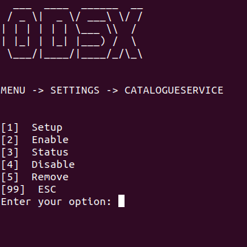

# Catalogue Service in ODSx

## Prerequisites

 - Compile and build jar from https://github.com/GigaSpaces-ProfessionalServices/CSM-Magic-Tools/tree/master/catalogue-service
 - Copy above built **catalogue-service.jar** to <u>gs-odsx/systemServices/catalogue</u> directory.
 - On the Grafana installed server, perform below steps:
    - Open file **<u>/etc/grafana/grafana.ini</u>**.
    - Locate **disable_sanitize_html** property and set it to **true** (Remove semicolon at beginning of the line to uncomment the line).
    - Locate **provisioning** and update its value to **/etc/grafana/provisioning** (Remove semicolon at beginning of the line to uncomment the line).
 - BLL microservices must be registered with consul catalog.
 - New endpoint *<u>/metadata</u>* must be available for each service registered in consul catalog.
	
## Catalogue Service Menu
              
 - Run **./odsx.py**
 - Select **Menu -> Settings -> Catalogue Service**

### Setup (Menu -> Settings -> Catalogue Service > Setup)
 - Select **Setup** to register the service. With this options following tasks will be performed 
    - Register the Catalogue service in pivot machine.
    - New dashboard "Catalogue" will be available in Grafana with HTML panel referring to Catalogue Service URL.
### Enable(Menu -> Settings -> Catalogue Service > Enable)
 - Allows to start the service.
### Status(Menu -> Settings -> Catalogue Service > Status)
- Shows current status of the service.
### Disable(Menu -> Settings -> Catalogue Service > Disable)
 - Allow to stop the service.
### Remove(Menu -> Settings -> Catalogue Service > Remove)
 - Removes service from the pivot machine
 - Removes Catalogue dashboard from Grafana
